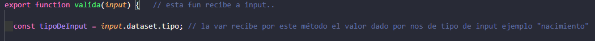

# Validation de forms

## Atributos de validación en html

Como vi en otros cursos en el html si en el form agrego required hace a ese campo obligatorio, si es un campo de email
debo por ejemplo agregar el tipo para que cumpla con la estructura `xxxxxx@xxxx.algo`

En al campo contraseña para comenzar puedo poner un minimo y un máximo de caracteres `minlenght = "6"` / `maxlenght = "12"`

Lo que aprendimos en esta aula: (estuvo incompleta faltan 2 puntos)

REGEX (regular expression)

En la etiqueta password por ejemplo puedo usar un patrón con una expresión regular se pueden buscar en stack overflow o 
similares y copiarlo. 

Podemos definir una Expresión Regular (o RegEx, Regular Expression), como una cadena de texto genérica, que se usa a 
modo de patrón, y que sirve para localizar trozos de texto dentro de otro texto mayor.

https://developer.mozilla.org/es/docs/Web/JavaScript/Guide/Regular_Expressions

https://stackoverflow.com/questions/19605150/regex-for-password-must-contain-at-least-eight-characters-at-least-one-number-a

https://regexr.com/

En este ejemplo: 
`"^(?=.*[a-z])(?=.*[A-Z])(?=.*[0-9])(?!.*[ !@#$%^&*_=+-]).{6,12}$"`

1. abre y cierra con estos caracteres = ^ $ todo lo que este adentro lo evalúa.
2. `(?=.*[a-z])` esto significa que: `?=` se aceptaran caracteres `"."` sin saltos de línea o espacios el `"*"` 
significa que al menos debe haber uno en el rango entre `[a y z]` minúsculas.
3. `(?!.*[ !@#$%^&*_=+-])` este dice: `?!` no vamos a aceptar `.` saltos de línea tampoco nada dentro de este conjunto:
`*[ !@#$%^&*_=+-]` el asterisco marca el inicio del conjunto los corchetes lo encierran y lo de adentro se evalúa, 
espacio y los demás caracteres
4. `.{6,12}` rango de 6 a 12 mínimo y máximo
5. En el title le digo los parámetros al usuario

* Hacer validación en el propio HTML utilizando los atributos required y type.
* Utilizar reglas del regex dentro del atributo pattern para validar el campo de contraseña.
* Mandar un mensaje customize de error en el navegador.

 Lo que aprendimos en esta aula: aula 2 también incompleta

* Crear funciones para validaciones del formulario.
* Definir mensajes customizados para validaciones fuera del HTML.
* Utilizar data attributes para trabajar con JavaScript.
* Dejar la función de validación más genérica para funcionar con cualquier input.

### Fecha de nacimiento

La validación se hará en JS en un módulo que se exportará. en esta clase usa un ejemplo pero luego en el código final hace 
algo diferente para validar muchos compos a la vez.

Utiliza él `data-` para seleccionar todos los campos, los diferencia con el nombre `tipo` entonces los `data-tipo` van a
formar un array con los valores individuales de cada tipo quedando así: `data-tipo: "nacimiento"`.

Con esto hecho creamos una const que va a recibir ese valor del input 

Luego creo un objeto: que va a tener como llave al tipo de `data ""`, por cada tipo de los inputs verificar si existen dentro
de los validadores.

El método `.validity` nos devuelve un objeto

entre sus atributos esta `valid` que nos dice si esta o no validado, por ello este if nos dice:

si es valido quiero que quite la clase, sino (else) quiero que ponga la clase css de error. **¡¡¡importante la clase se aplica
al padre!!!**

https://app.aluracursos.com/course/javascript-web-validacion-formularios-html5/task/77542  -- clase de mensaje de error

https://developer.mozilla.org/en-US/docs/Web/API/ValidityState  -- documentación de validaciones

### Las clases de este curso no son claras 

## vercel app

https://app.aluracursos.com/course/javascript-web-validacion-formularios-html5/task/77547

.
